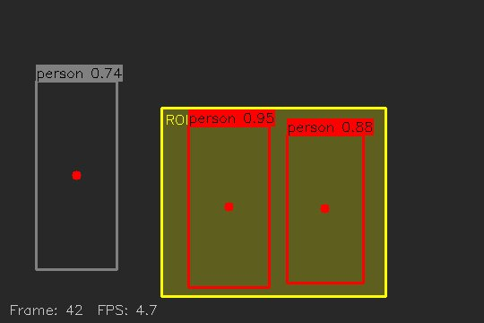

# Vision Pipeline — OpenCV Preprocessing + Faster R-CNN Person Detection

A self-study computer-vision project that builds, from scratch and without a
high-level framework, the core pieces of a real-time perception pipeline:
OpenCV preprocessing utilities, a torchvision **Faster R-CNN** person-detection
inference wrapper, a region-of-interest (ROI) intrusion rule engine, background-
subtraction motion detection, CSV event logging, and an end-to-end driver that
ties them together (`video → detect → ROI rule → log → annotated output`).

The goal is to understand *how* each stage works (colour-space and tensor
conventions, confidence thresholding, throughput tricks, keep-out rules) well
enough to explain and extend it — not to wrap a turnkey library.



> The image above is a **synthetic illustration** of the visualization /
> rule-engine layer (hand-placed boxes, no model involved): red boxes are
> "intruders" whose centre falls inside the yellow ROI, grey boxes are outside
> it. It is *not* a real model detection — see [Results](#results) for the
> actual measured inference behaviour.

---

## Architecture

```
        video / webcam
              │
              ▼
      ┌──────────────┐     every Nth frame      ┌─────────────────────────┐
      │   capture    │ ───────────────────────▶ │ Faster R-CNN (person)   │
      │ (read_video) │                          │  model_loader.detect()  │
      └──────┬───────┘                          └───────────┬─────────────┘
             │ frame                                         │ boxes + scores
             │                                               ▼
             │                                    ┌────────────────────┐
             │                                    │ ROI rule engine    │  roi_guard
             │                                    │ (centre-in-zone)   │
             │                                    └─────────┬──────────┘
             ▼                                              │ intrusions
      ┌──────────────┐   motion mask + ratio                ▼
      │ MOG2 motion  │ ──────────────────────────▶ ┌────────────────────┐
      │  detector    │                             │  event logger      │  event_logger
      └──────┬───────┘                             │  (timestamped CSV) │
             │                                     └────────────────────┘
             ▼
      ┌──────────────────────────────────┐
      │ annotate (draw_shapes) +         │
      │ VideoWriter → result.mp4         │
      └──────────────────────────────────┘
```

The same loop is implemented in [`04_pipeline/run_pipeline.py`](04_pipeline/run_pipeline.py).

---

## Features

- **Preprocessing primitives** — fixed / scaled / aspect-preserving resize,
  boundary-clamped ROI crop, and YOLO-style letterboxing.
- **Visualization layer** — bounding boxes with label tags, centre points,
  translucent ROI overlays, and an FPS / frame info bar.
- **Person detection** — torchvision Faster R-CNN ResNet-50 FPN loaded via the
  modern `Weights` enum API, with BGR→RGB conversion, tensor normalisation,
  COCO person-class filtering, and score thresholding.
- **ROI intrusion rule engine** — a centre-point-in-zone geofence check (the
  same idea as a keep-out / safety zone).
- **Motion detection** — `BackgroundSubtractorMOG2` foreground-ratio gating.
- **Event logging** — append-only CSV with UTC timestamps and frame indices.
- **Throughput trick** — run the detector every *N* frames and reuse the last
  boxes in between, with per-frame FPS instrumentation.

---

## Tech stack

| Area | Choice |
|---|---|
| Language | Python 3.12 / 3.13 |
| Vision | OpenCV (`opencv-python-headless`) |
| Detection | PyTorch + torchvision (pretrained Faster R-CNN, inference only) |
| Numerics | NumPy |
| Tooling | pytest, ruff, GitHub Actions |

Dependencies are pinned in [`requirements.txt`](requirements.txt) (runtime) and
[`requirements-dev.txt`](requirements-dev.txt) (tests + lint).

---

## Project structure

```
.
├── 01_basics/                # OpenCV fundamentals
│   ├── read_video.py         #   read a stream, extract frames to disk (argparse)
│   ├── draw_shapes.py        #   boxes / labels / ROI overlay / info-bar helpers
│   └── resize_crop.py        #   resize / crop / letterbox preprocessing
├── 02_detection/             # object detection
│   ├── model_loader.py       #   Faster R-CNN loader + detect() person wrapper
│   ├── detect_image.py       #   single-image detection driver
│   └── detect_video.py       #   video/webcam detection driver
├── 03_anomaly/               # rule layer
│   ├── roi_guard.py          #   ROI intrusion rule engine (pure logic)
│   ├── motion_detector.py    #   MOG2 motion detector
│   └── event_logger.py       #   CSV event logger
├── 04_pipeline/
│   └── run_pipeline.py       # end-to-end driver tying 01–03 together
├── tests/                    # pytest smoke + unit tests
├── assets/                   # tiny committed sample image for this README
└── requirements*.txt
```

> The numbered directory names mirror the order the pieces were built. They are
> not valid Python package names, so the drivers import sibling modules by
> adding their directories to `sys.path` (see the header of each driver).

---

## Installation

```bash
python3 -m venv .venv
source .venv/bin/activate          # Windows: .venv\Scripts\activate
pip install -r requirements.txt    # add -r requirements-dev.txt for tests/lint
```

`torch`/`torchvision` are only needed for the detection drivers; the
preprocessing, motion, ROI, and logging code runs without them.

---

## Usage

Run everything **from the repository root**.

```bash
# Day 1 — preprocessing & drawing demos (synthetic images, no model)
python 01_basics/resize_crop.py
python 01_basics/draw_shapes.py
python 01_basics/read_video.py --source 0 --every 30          # 0 = webcam

# Day 2 — detection (downloads ~160 MB of weights on first run)
python 02_detection/detect_image.py path/to/image.jpg
python 02_detection/detect_video.py --source 0 --max-frames 300

# Day 4 — full pipeline
python 04_pipeline/run_pipeline.py --source clip.mp4 --roi 200 150 450 380
python 04_pipeline/run_pipeline.py --source clip.mp4 --no-detect   # motion only, no torch
```

Outputs (frames, annotated video, `events.csv`) are written to `data/output/`,
which is git-ignored so captured imagery is never committed.

---

## How it works

**Preprocessing (`01_basics/resize_crop.py`).** Detectors expect a fixed input
size, and downscaling trades a little accuracy for speed. `crop_roi` clamps
coordinates to the frame so an out-of-bounds box never raises; `letterbox`
resizes by the longest side and zero-pads to a square, preserving aspect ratio
(the standard YOLO-style input transform).

**Detection (`02_detection/model_loader.py`).** OpenCV frames are BGR `uint8`;
the model wants an RGB `float` tensor in `[0, 1]` shaped `(C, H, W)`. `preprocess`
does the `cvtColor` + `to_tensor` conversion, and `detect` runs the model under
`torch.no_grad()`, keeps only COCO label `1` (person) above a score threshold,
and returns a tidy `[{"bbox": [x1, y1, x2, y2], "score": ...}]` schema.

**Rule layer (`03_anomaly/`).** `roi_guard` flags a detection when its box
*centre* lies inside the ROI rectangle — a simple, stable keep-out check.
`motion_detector` wraps MOG2 and reports the foreground-pixel ratio per frame.
`event_logger` appends timestamped rows to a CSV.

**Pipeline (`04_pipeline/run_pipeline.py`).** Captures frames, runs the detector
every *N* frames (reusing boxes in between for throughput), checks ROI intrusion,
scores motion, logs events, draws the overlay, and writes an annotated video.
`--no-detect` skips the detector entirely (and never imports torch) so the
motion + logging path runs anywhere.

---

## Testing

```bash
pip install -r requirements-dev.txt
ruff check .
pytest
```

The suite (`tests/`) covers:

- **Preprocessing smoke tests** — a synthetic image through every resize / crop /
  letterbox / draw op, asserting output shapes and padding.
- **ROI rule engine** — centre computation, inside/outside/edge cases, and that
  `check_intrusion` filters without mutating its input.
- **Event logger** — header-once-then-append behaviour and row contents.
- **Motion detector** — static frames report no motion; a moving block does.
- **Compile guard** — every source file is byte-compiled, which would have
  caught the original digit-prefixed-import `SyntaxError`.
- **Detection** — `preprocess` tensor shape (no weights). The full inference
  test is guarded behind `RUN_MODEL_TESTS=1` so it never downloads weights in CI.

---

## Results

Measured locally on CPU (Apple Silicon, macOS); these are honest small-scale
numbers, not benchmark targets:

- **Pipeline, motion + logging only** (`--no-detect`, 160×120 synthetic clip):
  ~270 FPS — confirms the non-detection path is effectively free.
- **Detection** (Faster R-CNN ResNet-50 FPN, CPU): the weights download and the
  full `detect()` path were exercised end-to-end. A single 640×480 forward pass
  takes **~4 s/frame (≈0.2–0.3 FPS)** on this CPU — which is exactly why the
  drivers detect every *N* frames rather than every frame, and why a real
  deployment wants a GPU or a lighter backbone. A synthetic blank frame yields
  zero person detections, as expected.

No detection numbers here are fabricated: the per-frame CPU latency above is the
only model figure measured in this environment, on synthetic frames (so detection
counts are zero by construction). Real-content detection examples and a GPU FPS
table are on the roadmap.

---

## Design decisions & what I learned

- **Channel/tensor conventions matter.** The BGR→RGB and HWC→CHW `/255` steps are
  the most common silent-failure source when bridging OpenCV and PyTorch.
- **Decouple the rule layer from the model.** ROI/motion/logging are pure,
  model-free logic, which keeps them fast, unit-testable, and swappable.
- **Throughput vs. latency.** Running a heavy detector every frame is wasteful;
  detecting every *N* frames and reusing boxes is a cheap, effective trade-off.
- **Reproducibility.** Pinned dependencies, a project-local virtualenv, lint, and
  a CI smoke suite keep the project runnable for anyone who clones it.

---

## Roadmap & limitations

- Pretrained, **inference-only**, and **single-class** (person) today.
- Lighter backbones (`fasterrcnn_mobilenet_v3_large_fpn`) for edge throughput.
- Polygonal ROIs and per-track dwell-time rules instead of a single rectangle.
- Real-content detection examples and a CPU-vs-GPU FPS comparison table.

---

## License

Released under the [MIT License](LICENSE).
